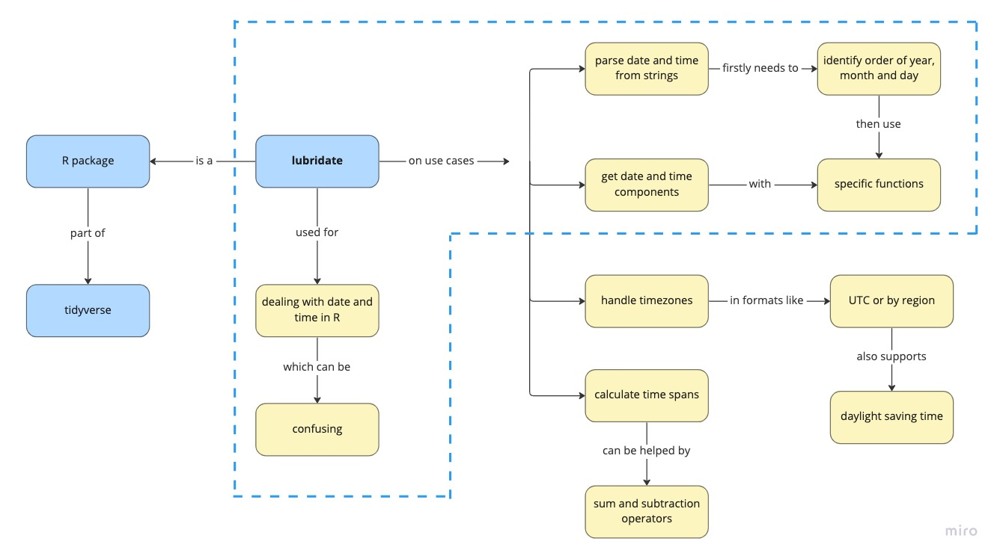

```{r setup, include=FALSE}
knitr::opts_chunk$set(echo = TRUE)
```

## 1. Learner persona

### A) Carol

#### General background

She was born in Macapá, Brazil, and moved to São Paulo to work in a consulting firm as Inbound Specialist to create better marketing strategies. In her free time, she loves to walk in the sunny parks and go to clubs at night.

#### Relevant experience

She is already familiar with analyzing data in Excel and is trying to automate her work. She participated in a full day R workshop at a R-Ladies conference and got inspired by the possibilities of programming in her work.

#### Perceived needs

She is struggling to analyze a bunch of tables she received, including data from sent emails that has many date formats. Wants to set up automations to parse dates in a correct way to fasten her analysis routines.

#### Special considerations

She gets very excited processing new information but is difficult to remember the details later. Also, she's using Zoom in her phone and following the class on RStudio Cloud in her laptop.

## 2. Concept map



<p style="text-align:right;">[Open in another tab](https://jeanprado.github.io/rstudio-certification/class/img/concept_map.jpg)</p>

## 3. Formative assessment

```{r echo=FALSE}
xaringanExtra::embed_xaringan(
  url = "https://jeanprado.shinyapps.io/formative-assessment/",
  ratio = "5:4",
  border = "none"
)
```

<p style="text-align:right;">[Open in another tab](https://jeanprado.shinyapps.io/formative-assessment/)</p>

## 4. Materials

```{r echo=FALSE}
xaringanExtra::embed_xaringan(
  url = "https://jeanprado.github.io/rstudio-certification/class/slides/",
  ratio = "4:3",
  border = "none"
)
```

<p style="text-align:right;">[Open in another tab](https://jeanprado.github.io/rstudio-certification/class/slides/)</p>
