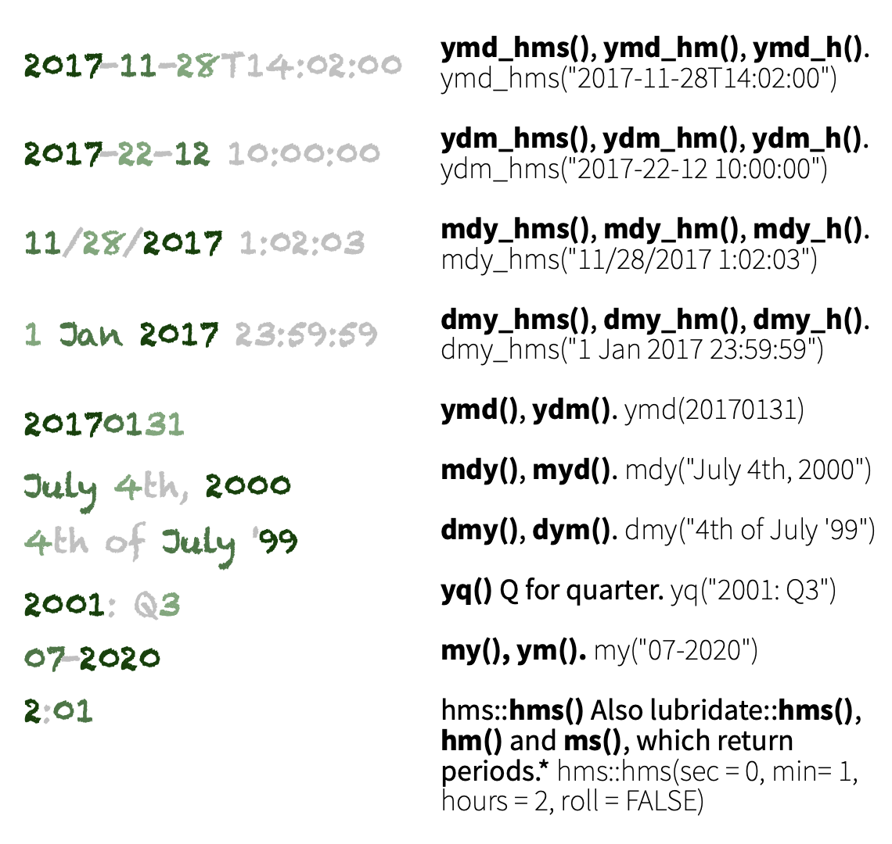
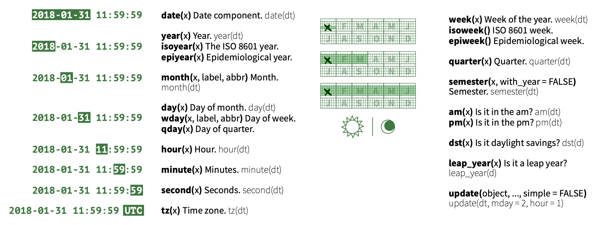

```{r setup, include=FALSE}
options(htmltools.dir.version = FALSE)
knitr::opts_chunk$set(
  fig.width=9, fig.height=3.5, fig.retina=3,
  out.width = "100%",
  cache = FALSE,
  echo = TRUE,
  message = FALSE, 
  warning = FALSE,
  hiline = TRUE
)
xaringanExtra::use_panelset()
```

```{r xaringan-themer, include=FALSE, warning=FALSE}
library(xaringanthemer)
style_duo_accent(
  primary_color = "#1381B0",
  secondary_color = "#FF961C",
  inverse_header_color = "#FFFFFF"
)
```

## Welcome!

### Should I be here?

???

- as you are watching
- if this class is for you (very likely)

--

- Really basic R knowledge

--

- Save time for tidying and transforming data

???

- most of a data analyst time is spent tidying data to be analyzed

--

- Analyze datasets that record an event in time

???

- very important variable for identifying underlying patterns

--

  - date
  
--

  - time
  
--

  - date and time

???

- sometimes the three in different formats each!

---
class: middle, center

## The problem with dates

---

## The problem with dates

Can be written in many different formats

???

- problem in programming. examples

--

- `2022-12-16`

???

- today's date
- programming-friendly way

--

- `12/16/2022`

???

- usually US locale

--

- `16/12/2022`

???

- most of the world

--

- `Dec 16, 2022`

???

- formal written way

--

- `16 de dezembro de 2022`

???

- locales: Brazil <3

---
class: middle, center

## How base R handles each of them

---

## How base R handles each of them

Using base function `as.Date()` which transforms string to Date class:

```{r}
(date <- as.Date("2022-12-16"))
```

--
```{r}
class(date)
```

???

if expected format, no problem

---

## How base R handles each of them

```{r error=TRUE}
(date <- as.Date("12/16/2022"))
```

???

- if don't fit
- why error?

--

<br>

**The problem:** not specific on default `YYYY-MM-DD`.

???

Y 4 digits, M 2 digits, D 2 digits

---

## How base R handles each of them

```{r error=TRUE}
(date <- as.Date("16/12/2022"))
```

--

<br>

Not sure if is what we expected... (should be `"2022-12-16"`)

???

- misunderstood because not in default format
- same date as we got first place

---
class: middle, center

## Advantage of `lubridate`

---

## Advantage of `lubridate`

- More explicit on what you're parsing

???

- very clear the input and output

--

- Doesn't need knowledge of `%m`, `%d`, `%y`, `%B`, `%p`, etc.

???

- weird conversion characters

--

- More freedom on date and time formats

???

- can parse most specific cases

--

- Easily extract date and time components

???

- functions to get separate time components (day, month)

--

- Better timezone handling

--

- Calculate time spans and duration

???

- not detail in this class

---
class: middle, center

## Using `lubridate`

???

get going with `lubridate`

---

## Using `lubridate`

### Date-time parsing

1. Identify order of the date/time elements

--

2. Use `lubridate` set of functions to parse it

--

### Example

1. **16 de dezembro de 2022** -> `date, month, year`

--

2. Use `lubridate::dmy()`

???

d, m, y: day, month, year

--

```{r}
lubridate::dmy("16 de dezembro de 2022")
```

simple as that 😉

???

also considers system default locale

---

## Date-time parsing

Set of functions (referenced from [lubridate cheat sheet](https://rawgit.com/rstudio/cheatsheets/main/lubridate.pdf))

```{r out.width="60%", fig.align='center', echo=FALSE}

```

???

- year, month, day, hour, minute, second
- specific: month-year and quarter

---
class: middle, center

## Date and time components

---

## Date and time components

```{r}
(date <- lubridate::dmy_hms("16 de dezembro de 2022 às 15:45:02"))
```

???

when you have a date/time element

--

### You can get components separately:

.panelset[


.panel[.panel-name[day]

```{r}
lubridate::day(date)
```

]


.panel[.panel-name[month]

```{r}
lubridate::month(date)
```

]

.panel[.panel-name[year]

```{r}
lubridate::year(date)
```

]

.panel[.panel-name[hour]

```{r}
lubridate::hour(date)
```

]

.panel[.panel-name[minute]

```{r}
lubridate::minute(date)
```

]

.panel[.panel-name[second]

```{r}
lubridate::second(date)
```

]

]

(always in `numeric` format)

???

easy to work around

tip: read the function and output

---

## Date and time components

Other cool stuff:

--

### Weekday

```{r}
lubridate::wday(date)
```

--

```{r}
lubridate::wday(date, label = TRUE)
```

???

- label (friday)
- factor, order correctly

---

## Date and time components

Other cool stuff:

--

### Week of the year

```{r}
lubridate::week(date)
```

???

close end of the year

--

### Quarter

```{r}
lubridate::quarter(date)
```

---

## Date and time components

Set of functions (referenced from [lubridate cheat sheet](https://rawgit.com/rstudio/cheatsheets/main/lubridate.pdf))

```{r out.width="100%", fig.align='center', echo=FALSE}

```

---

## Let's try it!

time to live code 🥸
